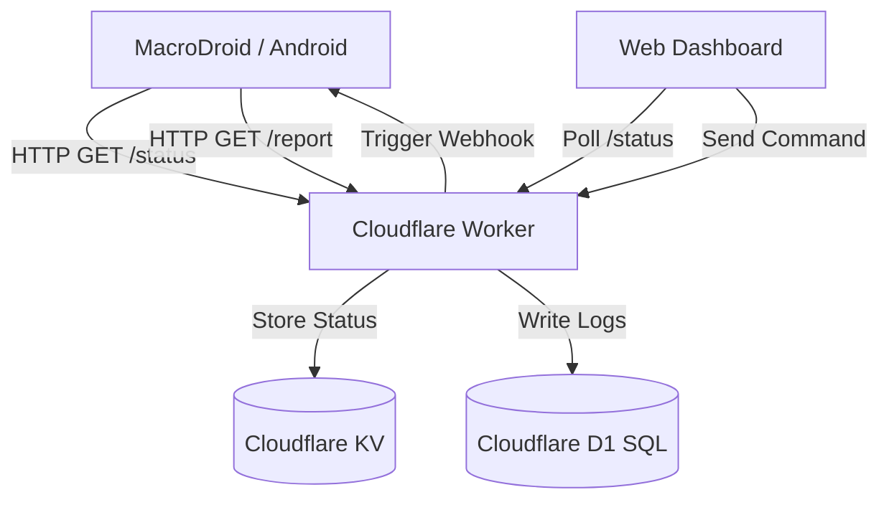

# Remote Phone Control UI

> **Tactical Android Command & Control Interface**
> Real-time device monitoring and automation powered by Cloudflare Workers, D1 SQL, and MacroDroid.

**Live Instance:** [ui.muffinjuice.xyz](https://ui.muffinjuice.xyz)

---

## ⚡ System Overview

This project provides a professional-grade, cyberpunk-themed dashboard to remotely monitor and control an Android device. It acts as a bridge between **MacroDroid** (on-device automation) and a web-based **Command Center**.

### 🏗️ Architecture


---

## 🔐 Authentication System

The platform implements a multi-layered security model to ensure restricted access:

- **Primary Gateway**: Protected by a global `ACCESS_KEY` secret. Valid authentication sets a `session=authorized` cookie with a 30-minute TTL.
- **Unauthorized Handling**: Attempting to access restricted paths without a session triggers a "Tactical Unauthorized" page with a 7-second auto-redirect to login and IP/Geo logging of the intruder.
- **Vault Security**: The file vault (`/vault`) requires a secondary `VAULT_PASS` secret. Successful auth sets a `vault_token=authorized` cookie (10-minute TTL).
- **MacroDroid Auth**: Device-to-Server communication is secured via a `REPORT_KEY` query parameter, validated against worker secrets.

---

## 🚀 Endpoints & API Reference

### User Interface (Authenticated)
| Path | Method | Description |
|---|---|---|
| `/` | GET | Secure Login Gateway |
| `/home` | GET | Main Dashboard (Command Center) |
| `/schedule` | GET | Task Scheduler Interface |
| `/requests` | GET | Audit Logs (HTTP request history) |
| `/statuslogs` | GET | Hardware Health Analytics |
| `/vault/list` | GET | Encrypted File Archive |

### System APIs
| Path | Method | Auth | Description |
|---|---|---|
| `/status` | GET | `REPORT_KEY` | Receive battery/temp/signal from device |
| `/report` | GET | `REPORT_KEY` | Update live location maps link |
| `/poll` | GET | Session | Real-time state fetch for dashboard |
| `/control` | GET | Session | Immediate command trigger via MacroDroid |
| `/upload` | POST | `REPORT_KEY` | Upload encrypted files (Images/Audio) to Vault |
| `/intel` | GET | Session | IP Geolocation lookup (cached) |

---

## 🛠️ Backend Infrastructure (Cloudflare Worker)

The backend is a monolithic **Cloudflare Worker** (`_worker.js`) handling 100% of the server-side logic:

- **Dynamic Routing**: A custom request handler processes both API calls and HTML page rendering.
- **HTML Injection**: Uses `HTMLRewriter` to dynamically inject a shared Cyberpunk navigation menu and styles into static assets (`home.html`, etc.).
- **Cron Scheduler**: A `scheduled` event handler runs every minute, checking the D1 database for pending commands and triggering them automatically.
- **Log Equalization**: An intelligent algorithm filters noisy requests (like `/poll`) from the history log while ensuring critical events are always recorded.
- **IP Intelligence**: Multi-provider geo-lookup logic (ipapi.co with fallback to ip-api.com) with a D1 caching layer to stay within rate limits.

---

## 🎨 Frontend Design System

The frontend is built for speed and aesthetics, adhering to a **"Tactical Cyberpunk"** design language:

- **Core Tech**: Vanilla HTML5, CSS3, and JavaScript. No heavy frameworks.
- **Theming**: Deep blacks (`#06080a`), tactical teals (`#00dca0`), and alert reds (`#ef4444`).
- **Typography**: Uses `Share Tech Mono` for a terminal feel and `Rajdhani` for UI elements.
- **Interactivity**: 
    - **Live Polling**: Dashboards refresh data every 5 seconds with "New Row" highlight animations.
    - **Glassmorphism**: Subtle backdrop blurs and semi-transparent panels.
    - **Responsive**: Fully optimized for mobile (Android/iOS) and desktop browsers.

---

## 📊 Database Schema (D1 SQL)

The project uses **Cloudflare D1** for high-performance, persistent data storage.

### Tables:
- **`logs`**: Every HTTP interaction is recorded (Timestamp, Method, Path, Status, IP, Source, Location).
- **`status_logs`**: Historical hardware heartbeats (Battery %, Temp, Signal dBm, Uptime).
- **`command_schedules`**: Queue for automated tasks (Command, Target Time, Status, Output Logs).
- **`geo_cache`**: Persistent cache for IP geolocation to minimize external API calls.
- **`vault_files`**: Metadata index for files stored in KV storage.

---

## 📦 Other Critical Systems

- **Equalization Algorithm**: Prevents logging bloat by sampling high-frequency `/poll` requests (5% sample rate) while capturing 100% of security-relevant events.
- **Vault Retrieval**: Serves binary data (Images/Video/Audio) from KV with correct MIME types and inline disposition.
- **Migration Suite**: Built-in `/migrate` endpoint to move legacy KV logs into the D1 SQL database.
- **Automated Cleanup**: The worker periodically purges old logs (keeping only the last 2000) to stay within D1 free-tier limits.

---

## ⚙️ Setup Instructions

### 1. Requirements
- Cloudflare Account
- Wrangler CLI installed
- MacroDroid on Android

### 2. Provisioning
```bash
# Create D1 Database
npx wrangler d1 create remote_control_ui

# Create KV Namespace
npx wrangler kv:namespace create LOCATION_KV

# Apply Schema
npx wrangler d1 execute remote_control_ui --remote --file=schema.sql
```

### 3. Secrets Configuration
```bash
npx wrangler secret put ACCESS_KEY    # Dashboard login
npx wrangler secret put REPORT_KEY    # MacroDroid auth
npx wrangler secret put VAULT_PASS     # File vault pass
npx wrangler secret put MACRO_ID       # MacroDroid Webhook ID
```

### 4. Deployment
```bash
npx wrangler deploy
```

---

## 📜 License
Personal use and experimentation. Built with 🦾 by [MuffinJuice](https://github.com/gopi470).

