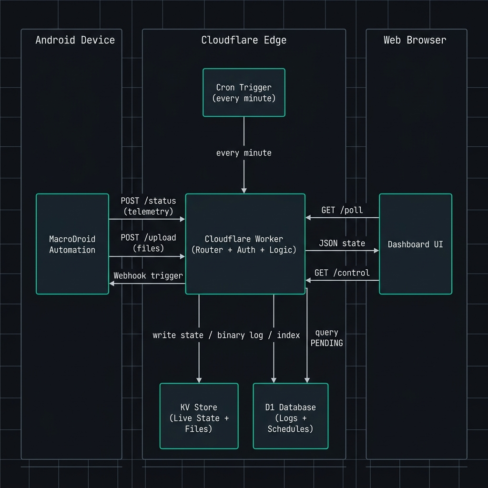

# Remote Phone Control UI — Extended Technical Documentation

This document provides a comprehensive, developer-grade deep dive into the internal logic, state machines, algebraic formulas, and architectural designs of the Remote Phone Control UI system.

---

## Table of Contents
1. [System Overview](#system-overview)
2. [System Architecture](#system-architecture)
3. [Authentication and Security](#authentication-and-security)
4. [Endpoints and API Reference](#endpoints-and-api-reference)
5. [Backend Infrastructure](#backend-infrastructure)
6. [Frontend Design System](#frontend-design-system)
7. [Mobile Responsiveness](#mobile-responsiveness)
8. [Database Schema](#database-schema)
9. [Task Scheduling Pipeline](#task-scheduling-pipeline)
10. [Vault HUD and Media Processing](#vault-hud-and-media-processing)
11. [Performance and Optimization](#performance-and-optimization)
12. [Browser Intelligence and Device Detection](#browser-intelligence-and-device-detection)
13. [Setup Instructions](#setup-instructions)
14. [Environment Variables Reference](#environment-variables-reference)
15. [Common Troubleshooting](#common-troubleshooting)
16. [Project File Directory](#project-file-directory)
17. [Future Expansion Ideas](#future-expansion-ideas)
18. [License](#license)

---

## System Overview

This platform provides low-latency telemetry ingestion, real-time command routing, and media vault management. Deployed on Cloudflare Workers, the system relies on D1 SQL databases for relational state management and KV namespaces for high-capacity binary assets and transient configurations.

### Performance Philosophy
Traditional servers introduce CPU overhead, cold starts, and container state maintenance issues. By moving the routing layer to Cloudflare's global edge network:
- Telemetry processing is executed within milliseconds of the target device transmitting status packets.
- Edge database lookups bypass long network round-trips by utilizing localized read replicas and memory caches.
- Memory consumption is optimized by streaming requests directly to disk or key-value structures without loading large blobs into worker instances.

---

## System Architecture

### Conceptual Layers
The system behaves as a three-tier architecture distributed between the edge cloud, the target hardware, and the administration console:

#### Android Device Layer (Sensor & Automation Provider)
The target Android device acts as a sensor gateway and automation executor. Using MacroDroid:
- Hardware changes (such as battery charge, signal degradation, volume slider shifts) are bound to trigger events.
- These events execute HTTP POST requests payloaded with JSON telemetry datasets pointing to the Cloudflare Worker status endpoint.
- File system watchers monitor local directories (such as camera folders or audio recorders) and automatically stream binary data blocks to the worker upload path.

#### Cloudflare Workers Layer (Serverless Application Kernel)
The worker script runs on Cloudflare's serverless V8 isolate engine. It acts as the routing kernel, handling:
- Security validation (session verification, JWT validation, cookie decryption).
- Telemetry state merging and location coordinate caching.
- File vault cataloging and binary block streaming using HTTP range slicing.
- Scheduled task verification and automated Cron triggers.

#### Client Dashboard Layer (User Console)
The frontend dashboard provides a graphical interface representing the active state of the device:
- It maintains an adaptive polling interval, querying the worker status endpoint via AJAX.
- It translates raw volume percentages and toggle states into interactive UI columns, sliders, and progress indicators.
- It displays historical status logs, schedule logs, and audited HTTP request histories via smart table rehydration.

#### KV and D1 Division of Labor
To keep resource costs at zero and speed at maximum, storage responsibilities are divided by access pattern:
- Cloudflare Key-Value (KV) Storage: Optimized for high-throughput, simple lookup parameters. It holds the active live state JSON block (read on every poll request) and raw media files (images, audio records, and video recordings).
- Cloudflare D1 SQL Database: Optimized for relational queries, structured log filtering, and transactional updates. It manages HTTP request logs, historical battery/signal heatmaps, queued cron commands, and vault file metadata indexes.

---

## Authentication and Security

### JSON Web Token (JWT) Details
Session authorization utilizes JSON Web Tokens (JWT) signed with the Hash-based Message Authentication Code (HMAC) using the SHA-256 algorithm (HS256).

#### Token Structure
- Header: Specifies the algorithm (HS256) and token type (JWT).
- Payload: Contains standard claims:
  - sub (subject): set to admin.
  - iat (issued at): epoch timestamp when the session was created.
  - exp (expiration): set to 24 hours after issuance.
- Signature: Generated by hashing the base64url-encoded header and payload with either the custom JWT_SECRET or the ACCESS_KEY fallback.

#### Verification Pipeline
On every incoming restricted request, the worker parses the HTTP Cookie header, extracts the session token, decodes the payload, validates that the expiration timestamp is in the future, and recalculates the signature using the server-side secret. If any check fails, the session is invalidated, and the request is aborted.

### Absolute Inactivity Guard Engine
Rather than relying on JavaScript window timer loops (which are routinely throttled or paused by modern mobile browsers to reduce battery drain in background tabs), the platform implements a time-delta evaluation mechanism:
- User activity listeners (bound to click, keydown, scroll, and touchstart events) update a value stored in browser local storage with the current system millisecond value.
- Every sixty seconds, a background loop calculates the delta between the current system time and the last saved activity timestamp.
- If this delta exceeds thirty minutes, the browser clears all cookies and forces a redirection to the logout gateway.
- If the browser tab was suspended in the background for hours, the check runs instantly upon tab activation, ensuring an immediate session termination.

### Centralized System Endpoint Auth Guard & Tactical Logging
The worker implements a single, high-performance centralized authentication guard at the top level of the request routing engine. This guard serves as a strict gateway for all browser-facing system routes (e.g., /home, /schedule, /vault/*, /control, and /poll) while letting public login paths, static asset files (.js, .css, etc.), and device webhook dispatches (protected via REPORT_KEY) pass through cleanly.

When an unauthenticated client attempts to reach any protected system endpoint:
- The guard immediately intercepts the request.
- It parses connection metadata, extracting the connecting IP address, User-Agent header, and Cloudflare-injected geolocation parameters (country, region, city).
- It inserts a security audit log record into the D1 database with a status code of 401.
- It renders a custom themed crimson High Alert page displaying details of the blocked attempt with an animated lock symbol and a seven-second countdown.
- Once the countdown reaches zero, the browser is automatically redirected to the login gateway.

### Vault Encryption and Isolation
The vault features a separate password lock to guarantee security isolation. Even if a user session is active, files stored in the vault remain inaccessible unless a secondary VAULT_PASS challenge is completed. This sets a separate vault_token cookie with a short 10-minute expiry time.

---

## Endpoints and API Reference

| Route | Method | Access Level / Auth | Expected Input | Primary Action & Output |
|---|---|---|---|---|
| `/` | GET | None (Optional) | None | Serves the login page. Redirects to `/home` if already authenticated. |
| `/home` | GET | `session` Cookie | None | Serves the main Command Center dashboard UI. |
| `/schedule` | GET | `session` Cookie | None | Serves the Task Scheduler queue management UI. |
| `/requests` | GET | `session` Cookie | None | Serves the HTTP Audit Logs viewer table. |
| `/statuslogs` | GET | `session` Cookie | None | Serves the battery, signal, and telemetry logs chart. |
| `/schedule/logs` | GET | `session` Cookie | None | Serves the execution status history for queued commands. |
| `/vault/list` | GET | `session` & `vault_token` | None | Serves the file index gallery showing images, audio, and video files. |
| `/vault/display` | GET | `session` & `vault_token` | `id` (Query string) | Serves the standalone media analyzer HUD viewer. |
| `/status` | GET | `REPORT_KEY` | Telemetry parameters | Ingests and updates batter status, signal, and volume variables. |
| `/report` | GET | `REPORT_KEY` | Geolocation parameters | Ingests and updates target GPS coordinate variables. |
| `/upload` | POST | `REPORT_KEY` | Multipart stream | Ingests raw binary data of images, audio, or video logs. |
| `/poll` | GET | `session` Cookie | None | Returns the active state JSON block for real-time polling updates. |
| `/control` | GET | `session` Cookie | `action` (Query string) | Forwards commands immediately via webhook requests to MacroDroid. |
| `/intel` | GET | `session` Cookie | `ip` (Query string) | Resolves geolocation details of logged requests. |
| `/schedule/create`| POST | `session` Cookie | JSON Config payload | Appends a new command task to the database queue. |

---

## Backend Infrastructure

### Configuration Validation & Error Toleration System
To prevent server-side crashes during deployment and simplify onboarding for new users:
1. On every incoming request, the worker first executes a configuration validation check.
2. It verifies that required database bindings (`DB`, `LOCATION_KV`, `ASSETS`) are initialized.
3. It validates that the required production secrets (`ACCESS_KEY`, `REPORT_KEY`, `VAULT_PASS`, `MACRO_ID`) are configured and do not match the default placeholder strings from the template.
4. If any binding or secret is missing or unconfigured, the worker halts standard request processing and serves a beautifully styled tactical red diagnostics page (`System Setup Status`).
5. This page displays the specific missing items along with the exact terminal command required to configure them (e.g. `wrangler secret put ACCESS_KEY`) and copy-to-clipboard functionality.

### Key-Value Status Merging Pipeline
When the worker receives status parameters from the device, it avoids standard flat object replacement:
1. It fetches the existing status JSON string from LOCATION_KV.
2. It parses the string into a temporary memory object.
3. It loops through all incoming query parameters and overrides only the modified fields (such as updating netmonster_status while leaving battery_level intact).
4. It sets the updated parameter to the worker's current server time.
5. It stringifies the merged object and writes it back to the KV storage space.

### NetMonster Sanitizer Logic
Cellular network diagnostics returned by Android APIs can contain generic placeholder text when connections drop or switch (such as "NETMONSTER", "N/A", "null", or empty strings). The worker applies a sanitization filter:
- It evaluates both the primary netmonster_status parameter and the backup netmonster_status2 parameter.
- It runs a match validation routine to check for known generic placeholders.
- If the primary parameter is generic or missing, it evaluates the backup parameter.
- If both are invalid, the field is skipped, preventing the system from polluting the dashboard with meaningless network labels.

### Unicode Base64 Encoding Mechanism
Standard base64 encoding utilities (such as btoa in JavaScript) throw errors when processing strings that fall outside the Latin-1 character set. Because cell tower strings and carrier diagnostics contain special symbols and non-ASCII characters, the worker utilizes a two-step transformation:
- Encoding: The string payload is passed through encodeURIComponent to convert non-ASCII characters into URL-encoded hexadecimal sequences. The resulting safe ASCII string is then encoded via btoa.
- Decoding: The decoded base64 string is passed to decodeURIComponent, restoring the original Unicode character representation on the dashboard without risk of execution crashes.

### HTTP 206 Slicing Implementation
To support scrubbing through media assets (such as surveillance videos or audio recordings) on Safari and Chrome browsers:
1. The worker intercepts requests containing a Range header (for example, bytes=1024-2048).
2. It parses the requested range start and range end coordinates.
3. It retrieves the binary stream from Key-Value storage, slicing the buffer from the requested start byte to the end byte.
4. It crafts an HTTP 206 response, appending the Content-Range (bytes start-end/total) and Content-Length headers, and streams the partial byte block to the browser.

---

## Frontend Design System

### Design Guidelines
- Neon Styling: Element borders utilize CSS box-shadow overrides to create glowing teal accents against a solid dark gray backdrop.
- Terminal Aesthetic: Text blocks use a fixed-width monospace font to emulate a system terminal read-out, making logs and metrics highly readable.

### Fluid Clip-Path Liquid Wobble Animation
The top edge of the volume level indicators uses an animated wave graphic to represent liquid filling:
- The bar's top border uses a dynamic CSS clip-path polygon configuration.
- The polygon's top edge coordinates oscillate using sinusoidal path keyframes.
- Because only the top edge vertices are animated, the body of the bar remains solid while the surface exhibits a natural fluid ripple.

### Drag-to-Slide Volume Mechanics
The vertical volume bars utilize coordinated event listeners to enable sliding controls:
- Mousedown and touchstart listeners activate tracking.
- Mousemove and touchmove listeners calculate the vertical coordinate position of the cursor relative to the slider's total height.
- The volume level is mapped to a value between zero and one hundred, updating the UI dynamically and sending the control request when tracking stops.

---

## Mobile Responsiveness

### Horizontal Table Scrolling
Tables containing HTTP histories and telemetry logs are wrapped in parent containers configured with overflow-x: auto and customized low-profile scrollbars. This keeps column layouts readable on narrow phone screens without scaling down the font size.

### Fluid Flex Containers
Dashboard control bars and headers utilize flex-wrap styling. When the viewport narrows, control buttons wrap cleanly to a new line instead of causing horizontal layout breaks or text clipping.

### Viewport Configuration and Zoom-Out Mechanics
To allow users to pinch-zoom the dashboard on mobile screens down to a 0.3x scale:
- The standard width=device-width instruction is omitted from the viewport meta tag, as this setting locks the page to the device's default width and blocks zoom-out gestures.
- The meta tag specifies initial-scale=1.0, minimum-scale=0.1, maximum-scale=5.0, and user-scalable=yes.
- This allows mobile browsers to zoom out, exposing the entire desktop dashboard layout on a small screen.

---

## Database Schema

| Table Name | Primary Key | Columns & Metadata |
|---|---|---|
| `logs` | `id` | `timestamp` (TEXT), `method` (TEXT), `path` (TEXT), `status` (INTEGER), `ip` (TEXT), `user_agent` (TEXT), `location` (TEXT) |
| `status_logs` | `id` | `timestamp` (TEXT), `battery_level` (INTEGER), `battery_status` (TEXT), `battery_temp` (TEXT), `signal_strength` (INTEGER), `uptime` (TEXT), `extra_status` (TEXT) |
| `command_schedules` | `id` | `command` (TEXT), `params` (TEXT), `execute_time` (INTEGER), `status` (TEXT), `log_output` (TEXT) |
| `geo_cache` | `ip` | `country` (TEXT), `region` (TEXT), `city` (TEXT), `timestamp` (TEXT) |
| `vault_files` | `id` | `file_id` (TEXT), `file_type` (TEXT), `file_size` (INTEGER), `content_type` (TEXT), `timestamp` (TEXT) |

### Table Columns and Types
- logs: Stores audit trails of HTTP requests (Primary Key id, timestamp, method, path, status, ip, user_agent, location).
- status_logs: Stores hardware battery, temperature, signal, and system uptime logs (Primary Key id, timestamp, battery_level, battery_status, battery_temp, signal_strength, uptime, extra_status).
- command_schedules: Manages queued tasks (Primary Key id, command, params, execute_time, status, log_output).
- geo_cache: Stores cached IP location data (Primary Key ip, country, region, city, timestamp).
- vault_files: Stores metadata for uploaded files (Primary Key id, file_id, file_type, file_size, content_type, timestamp).

---

## Task Scheduling Pipeline

### Scheduler State Machine
Scheduled tasks transition through three states:
- PENDING: The task is successfully queued and waiting for its execution time.
- EXECUTED: The Cron trigger successfully executed the task and updated the record.
- FAILED: The execution attempt failed, and the error output was logged.

### Cron Execution Loop
1. The Cron trigger fires at one-minute intervals.
2. The worker queries the command_schedules table for records marked PENDING where execute_time is less than or equal to the current timestamp.
3. The worker loops through the matched tasks and fires the MacroDroid control webhook.
4. The worker updates the status of the tasks based on the webhook response and saves the execution logs to the database.

---

## Vault HUD and Media Processing

### Asynchronous Client-Side Audio PCM Decoding
To present an authentic voiceprint profile instead of a simulated graphic visualizer, the standalone HUD media center decodes actual audio channels directly in the browser.
- Offline Decoding Pipeline: When an audio source is loaded, it intercepts the URL and performs a binary fetch requesting the audio resource. It passes the resulting binary data directly into the OfflineAudioContext decode method.
- Peak Downsampling: The mono channel raw floating-point samples are grouped into two hundred and fifty sequential blocks. For each block, it calculates the absolute amplitude average.
- Dynamic Range Normalization: It maps the absolute peak value to a ceiling of ninety pixels, scaling all other bars proportionally. It applies a soft cosine window padding to both boundaries (fade-in and fade-out over fifteen bars) to draw a clean vocal waveform canvas.

### Binary-level JPEG EXIF/TIFF Parsing
Surveillance photographs contain critical parameters that must be reviewed. The HUD integrates a lightweight binary parser that walks JPEG structures without external dependencies:
- Marker Traversal: The parser scans the binary data using a DataView. It skips the Start of Image marker and reads headers until it locates the APP1 Marker.
- TIFF Header Parsing: It validates the Exif signature, detects byte endianness (Big Endian or Little Endian), and skips to the first Image File Directory.
- Directory Resolution: It searches the tag catalogue for the GPS Info directory pointer. Upon resolution, it walks the GPS directory to extract latitude and longitude references and coordinate values.
- Coordinate Conversion: Rational coordinates (stored as numerator and denominator fractions) are translated into high-precision decimal coordinates (degrees + minutes divided by sixty + seconds divided by thirty-six hundred) and multiplied by negative one if referencing West or South vectors, enabling Google Maps plotting.

### Multi-Touch Pinch-to-Zoom Gestures
To optimize mobile review of high-resolution aerial and device photos, the display canvas supports native pinch gestures:
- Calculated Scale Matrix: Tracks pointer touches. If two touches are present, it continuously computes the hypotenuse distance between pointers.
- Pinch Ratio Mapping: It computes a scaling factor against the original touch delta and maps the result to a strict one hundred percent to five hundred percent zoom scale.
- Trackpad Intercepts: Intercepts desktop trackpad wheel gestures (when combined with the Ctrl key) to scale zooming values smoothly by increments of twelve percent while calling preventDefault to lock browser viewport scaling.

---

## Performance and Optimization

### Write-Filter Ingestion & Log Equalization
To guarantee optimal database performance and completely protect Cloudflare D1 write quota limits from getting exhausted:
- **Asset & Silent Poll Filtering**: The request logging engine evaluates incoming pathnames and completely skips writing logs for all static asset requests (matching `.css`, `.js`, `.png`, `.jpg`, `.svg`, `.ico`, `.woff2`, etc.) and quiet background count-down polling endpoints (`/api/auth/check`). This eliminates over 95% of wasteful logging transactions during active use.
- **Log Equalization Sampling**: For other continuous heartbeats (such as `/poll`), a random check is run to discard 95% of the entries, while retaining 100% of security events, administrative logins, webhook executions, and server errors.

### Non-blocking Analytics
Logging writes are wrapped in the worker's event context:
- The worker prepares the response and sends it back to the client immediately.
- It then executes database logging writes asynchronously inside the event.waitUntil context.
- This allows logging queries to execute in the background without holding up the client response.

### Smart AJAX Rehydration
The client interface avoids full table redraws during active polling:
- When fetching status updates, it requests only the most recent ten log records.
- The client-side script compares the IDs of incoming records with the rows currently rendered in the DOM.
- It prepends only new entries and applies a transient CSS highlight animation to indicate the update.

### Auto-Cleanup Routine
To stay within the free-tier limits of Cloudflare D1 and ensure high performance, the worker executes a cleanup routine with a five percent probability on every request. The D1 SQL statement deletes rows from the logs table where the ID is found in the ordered list of IDs sorted by descending timestamp, starting after the first two thousand records. This rolling window approach keeps only the two thousand most recent logs, preventing the database from growing indefinitely.

### Edge Storage Constraints and Scaling Limits
To run the application entirely within the free limits of Cloudflare Workers, KV, and D1, the system adheres to strict storage and operational boundaries:

| Resource Layer | Free Tier Limit | Application Safeguard & Allocation |
|---|---|---|
| Cloudflare Workers CPU Time | 10ms per request | Execution is optimized to complete routing and auth checks in under 2ms. Heavy processes (like D1 writes) are deferred out-of-band using `event.waitUntil`. |
| Cloudflare D1 Storage | 10MB total capacity | Maintained via a rolling log cleanup. The auto-cleanup routine restricts logs to the 2,000 most recent entries. |
| Cloudflare KV Storage | 1GB total capacity | Reserved for raw file media storage. Files in the vault are indexed up to 500 files for active lists. |
| Cloudflare KV Value Size | 25MB per key | Supports uploading large images and audio clips, but media processing limits uploads on MacroDroid to 20MB. |
| Cloudflare D1 Read/Write Limits | 5M Reads & 95K Writes per day | High-frequency polling hits the KV state cache (which uses zero-cost Worker Subrequests) instead of calling D1. Poll logs are sampled at a 5% rate (equalization logic). |

---

## Browser Intelligence and Device Detection

The worker analyzes the incoming User-Agent header and client hints to log device details:
- Browser Engine Detection: Maps browser strings to Chrome, Brave, Firefox, Safari, Edge, Opera, or Vivaldi.
- Device Model Resolution: Parses hardware patterns to identify iPhone, Samsung, Pixel, OnePlus, Xiaomi, Motorola, or generic desktop systems.
- OS Identification: Records Windows, Android, macOS, Linux, or iOS operating systems.

This details exactly what hardware and client software was used to access the control panel.

---

## Setup Instructions

For a detailed step-by-step setup guide on provisioning Cloudflare Workers, D1 database, KV namespaces, environment secrets, and configuring the MacroDroid automation on your Android device, please refer to the dedicated [setup.md](setup.md) guide.

### MacroDroid Integration Blueprint
To establish communication between the Android hardware and the Cloudflare Edge Worker, configure the MacroDroid tasks according to the following specifications:

#### 1. Command Webhook Trigger (Incoming)
* **Trigger Type**: Webhook (incoming).
* **Identifier**: Match the `MACRO_ID` string configured in wrangler secrets.
* **Parameter Mapping**: MacroDroid should listen for a URL parameter containing the execution command (e.g. `action={command}`).
* **Actions**: A series of conditional branch tests evaluating the incoming variable to execute device scripts (such as taking a front camera capture, initiating an audio voice recording, or modifying sound slider states).

#### 2. Telemetry Ingestion Dispatch (Outgoing)
* **Action Type**: HTTP GET Request.
* **Target URL**: `https://[your-worker-domain]/status`
* **Query Parameters**:
  * `key`: Set to the secret `REPORT_KEY` string.
  * `battery`: Local device battery level percentage variable.
  * `battery_status`: Local device battery charge status state string.
  * `temp`: Local device battery temperature variable.
  * `sig`: Local network signal strength or decibel variable.
  * `uptime`: System uptime duration variable.
  * `netmonster_status`: Real-time network carrier status parameter.

#### 3. Vault Media Upload (Outgoing)
* **Action Type**: HTTP POST Request.
* **Target URL**: `https://[your-worker-domain]/upload`
* **Query Parameters**:
  * `key`: Set to the secret `REPORT_KEY` string.
  * `type`: Asset type identifier (must equal `image`, `audio`, or `video`).
  * `name`: Custom target filename string for storage mapping.
* **Request Content**: Send as Multipart Form Data or File Upload. Select the target file path variable (e.g. latest camera image or voice record output) as the upload payload field.

---

## Environment Variables Reference

| Variable Name | Required / Optional | Default / Fallback | Functional Description |
|---|---|---|---|
| `ACCESS_KEY` | Required | None | The primary administrative password for dashboard authentication. |
| `JWT_SECRET` | Optional | `ACCESS_KEY` | Private key for signing and verifying JWT session cookies. |
| `REPORT_KEY` | Required | None | Secret token required by MacroDroid to authorize status updates and uploads. |
| `VAULT_PASS` | Required | None | Secondary passcode required to authorize access to encrypted vault routes. |
| `MACRO_ID` | Required | None | The unique target ID of the device's MacroDroid webhook trigger. |
| `MACRO_KEY` | Optional | None | Secondary security parameter for authorizing external webhook commands. |
| `LOCATION_KV` | Required | None | Cloudflare KV namespace binding for live states and binary assets. |
| `DB` | Required | None | Cloudflare D1 Relational SQLite Database binding for logs and task data. |

---

## Common Troubleshooting

- Dashboard redirects to login loop: Ensure your browser is configured to accept cookies. The dashboard relies on a secure session cookie for authentication.
- Scheduled commands do not trigger: Check if the Cloudflare Workers Cron trigger is configured to fire. You can verify active schedules in the Cloudflare dashboard.
- NetMonster data returns blank values: Make sure the NetMonster status parameter matches the variables set in your MacroDroid variables list.

---

## Project File Directory

| File Name | Location | System Layer & Functional Purpose |
|---|---|---|
| `_worker.js` | Root | Monolithic backend worker containing all logic, routing, auth, and asset utilities. |
| `index.html` | Root | Static secure administrative login gateway template. |
| `home.html` | Root | Active telemetry metrics and real-time Command Center console dashboard. |
| `schedule.html` | Root | Interactive frontend queue controls for task scheduling. |
| `vault-display.html` | Root | Separate multimedia analyzer interface displaying metadata and waveforms. |
| `script.js` | Root | Main frontend client logic script controlling AJAX requests, sliders, and polling. |
| `style.css` | Root | Layout stylesheet containing tactical neon themes, variables, and wave animations. |
| `schema.sql` | Root | Relational SQLite layout script for Cloudflare D1 tables. |
| `wrangler.jsonc` | Root | Environment config file binding the worker to local databases and domains. |
| `favicon.svg` | Root | Vector asset automatically injected in response heads. |
| `.gitignore` | Root | Local git rules mapping files and directories excluded from commits. |
| `.assetsignore` | Root | Local Cloudflare deploy rules mapping files excluded from serverless builds. |
| `README.md` | Root | Primary system manual highlighting setup, routes, and high-level structure. |
| `READMEext.md` | Root | Extended technical developer reference detailing internal state and logic. |
| `docs/data_flow_diagram.png` | `docs/` | System data flow visual diagram. |

---

## Future Expansion Ideas

- Multi-Device Support: Add device ID tracking columns to D1 tables to manage multiple Android devices from a single dashboard.
- Custom Webhooks: Trigger alert emails or instant messaging notifications if battery levels drop below critical thresholds.
- Live Canvas Location Plotting: Integrate real-time mapping libraries to display coordinates directly on the dashboard screen.

---

## License

MIT License. See [LICENSE](LICENSE) for details. Built by [gopi470](https://github.com/gopi470).
